# Vhost-user Network Test

The purpose of this document is to do a performance test for vhost-user, bridge and masquerade network interface of VM. We choose Userspace CNI to configure underlay network with TSO support for better vhost-user TCP bandwidth, refer to document [Vhost-user Network](./vhost-user-net.md) to setup and use vhost-user network in Virtink.

The test includes:

- Latency of TCP/UDP communication between VMs runnning on same/different host (tested by `qperf`)

- TCP/UDP bandwidth/PPS (packets per second) between VMs running on same/different host (tested by `qperf`)

- Latency of simulation for real scenarios (tested by `mtr`)

- Bandwidth of simulation for real scenarios (tested by `iperf`)

## Environment

There are two hosts for test, the details are as follows.

host1/host2:

| NUMA  | CPU cores   | Memory    | Hugepages-1Gi | Management NICs                              | Storage NICs                                      |
|-------|-------------|-----------|---------------|----------------------------------------------|---------------------------------------------------|
| numa0 | 0-9,20-29   | 128638 MB | 30            | /                                            | 2 * Mellanox CX4 Lx 25Gb/s, Physical Switch 25Gb/s |
| numa1 | 10-19,30-39 | 128980 MB | 30            | 2 * Intel I350 10Gb/s, Physical Switch 10Gb/s | /                                                 |

## Methods

### Build Test Environment

#### Vhost-user interface

We choose Userspace CNI to configure underlay network with TSO support for better vhost-user TCP bandwidth, and attach Mellanox NIC to OVS-DPDK bridge. The OVS-DPDK will be allocated 1 dedicated CPU core and 1GB hugepages-1Gi from every NUMA node.

Each vhost-user VM will be allocated 1 dedicated CPU core and 1GB hugepages-1Gi from NUMA node0, test the performance of vhost-user interface in VM.

#### Bridge/Masquerade interface

Create a OVS bridge with TSO support on host, and attach Mellanox NIC to OVS bridge. Integrate with Multus CNI to assign bridge/masquerade interfaces to VM.

Each VM will be allocated 1 dedicated CPU core and 1 hugepages-1Gi from NUMA node0, test the performance of bridge/masquerade interface in VM.

> **Note**: It's not allowed to use `multus` network with `masquerade` interface except this test.

### Test Latency

Test latency of TCP/UDP communication between VMs running on same/different hosts, the TCP segment body size is from 1B to 128 MB, and the UDP datagram body size is from 1B to 1KB, refer to the following command:

```bash
qperf <server-ip> -oo msg_size:1:128M:*2 -vvs tcp_lat # for TCP latency, change the server-ip.

qperf <server-ip> -oo msg_size:1:1K:*2 -vvs udp_lat # for UDP latency, change the server-ip.
```

To simulate real scenarios, create multiple VMs on same/different hosts and try to run the following command simultaneously, with the average latency as the result:

```bash
mtr --no-dns --report --report-cycles 30 <ip> # change the ip
```

### Test Bandwidth/PPS

Test bandwidth/PPS of TCP/UDP communication between VMs running on same/different hosts, the TCP segment body size is from 1B to 128 MB, and the UDP datagram body size is from 1B to 1KB, refer to the following command:

```bash
qperf <server-ip> -oo msg_size:1:128M:*2 -vvs tcp_bw # for TCP bandwidth, change the server-ip

qperf <server-ip> -oo msg_size:1:1K:*2 -vvs udp_bw # for UDP bandwidth, change the server-ip
```

To simulate real secenarios, create multiple VMs on same/different hosts and try to run the following command simultaneously, take the sum of bandwidths as the bandwidth of network link and the average as the bandwidth from VM to VM.

```bash
iperf -s             # run this in server
iperf -c <server-ip> # run this in client, and change the server-ip
```

## Results

### Baseline

The latency and TCP bandwidth of Mellanox NICs between two hosts:

| TCP Bandwidth               | Latency                 |
|-----------------------------|-------------------------|
| 23.5 Gb/s (tested by iperf) | 13 us (tested by qperf) |

### Latency

#### TCP Latency (same host)

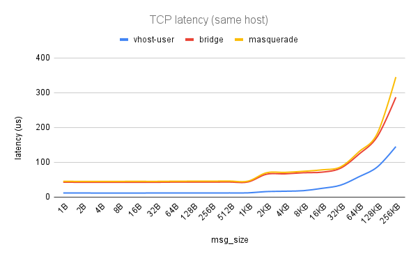

We only show the data from 1B to 256KB, the latency of vhost-user interface at the part not shown is still much lower than that of other network types.

#### UDP Latency (same host)

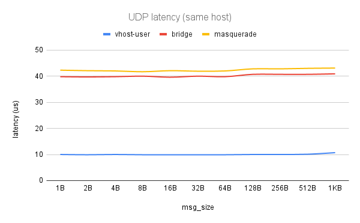

The latency of vhost-user interface is much lower than that of other network types.

#### TCP Latency (across hosts)

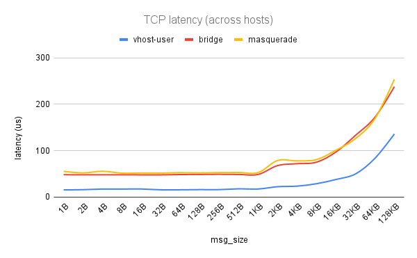

We only show the data from 1B to 256KB, the latency of vhost-user interface is much lower than that of other network types. But for `msg_size` bigger than 4MB, the latency of vhost-user interface is similar to that of other network types, it's likely that the PMD threads are not efficient enough at copying large packets in the dedicated NIC driver buffer across nodes.

#### UDP Latency (across hosts)

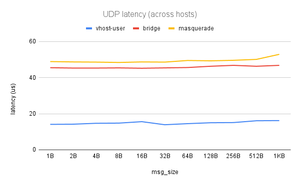

The vhost-user latency of interface is much lower than that of other network types.

### Bandwidth/PPS

#### TCP Bandwidth/PPS (same host)

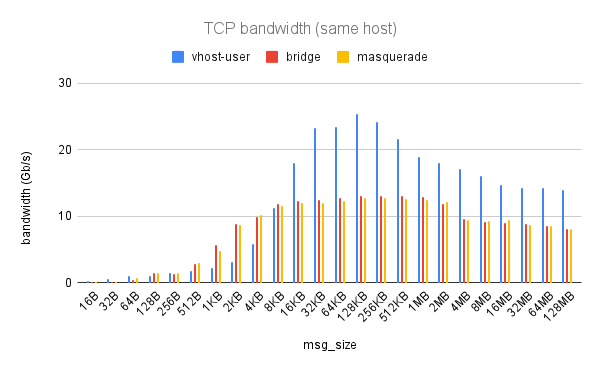 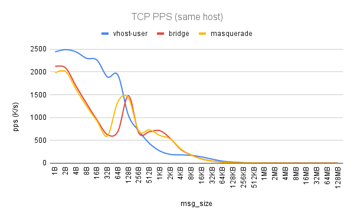

We only show the data from 16B to 128MB, the bandwidth and throughput of vhost-user are better than that of other network types at the part not shown.

It's shown the bandwidth and throughput of vhost-user are much better than that of other network types when `msg_size` is bigger than 16KB, but worse when `msg_size` is in the range of 128B to 8KB, the vhost-user works with less PPS. Usually, 128 KB body size will be used for TCP communication, it's default for `iperf`.

#### UDP Bandwidth/PPS (same host)

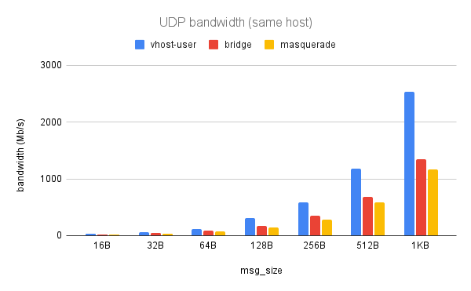 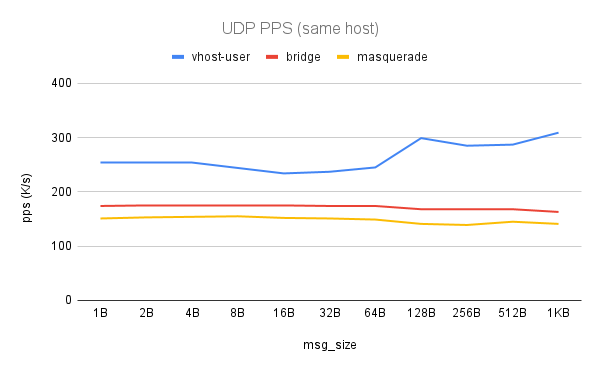

The bandwidth and throughput of vhost-user are better than that of other network types.

#### TCP Bandwidth/PPS (across hosts)

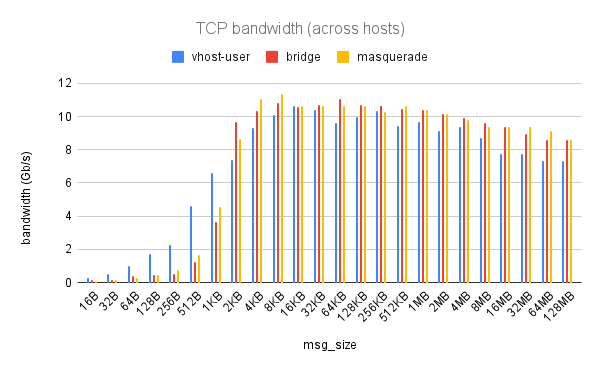 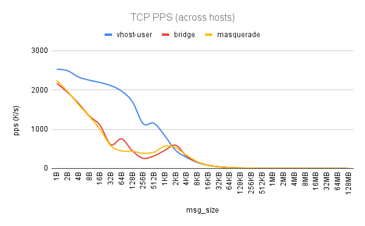

We only show the data from 16B to 128MB, the bandwidth and throughput of vhost-user are better than that of other network types at the part not shown.

It's shown the bandwidth and throughput of vhost-user are much better than that of other network types when `msg_size` is less than 1KB, but worse when bigger than 2KB, the vhost-user works with less PPS. In 128KB body size, the bandwidth and throughput of vhost-user are similar to that of other network types.

#### UDP Bandwidth/PPS (across hosts)

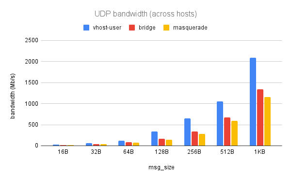 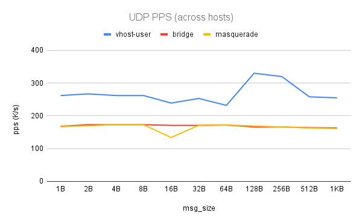

The bandwidth and throughput of vhost-user are better than that of other network types.

### Simulation

#### Latency

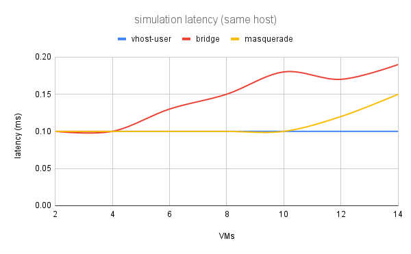

When VMs are running on same host, the latency of vhost-user is lower than that of other network types and remains stable as the number of running VMs increases.

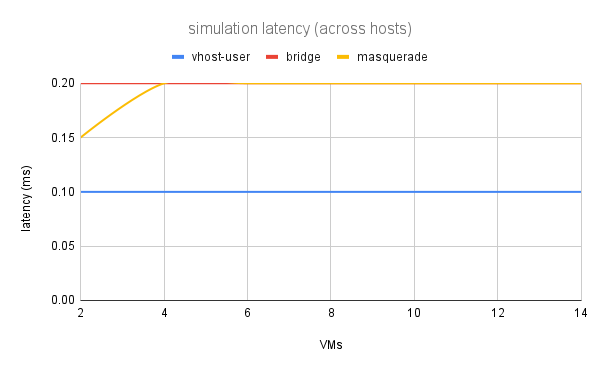

When VMs are running on different host, the latency of vhost-user is much lower than that of other network types and remains stable as the number of running VMs increases.

#### TCP Bandwidth

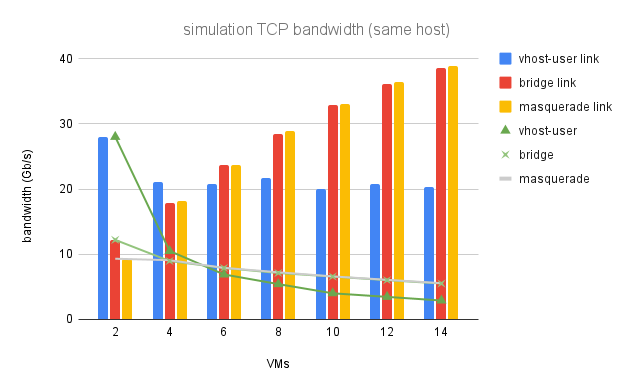

The bandwidth of vhost-user is much better than that of other network types when there are only two VMs communicating with each other, thanks to fewer copies of data from shared memory. As the number of VMs increases, the bandwidth of vhost-user link decreases but remains relatively stable, while the bandwidth of bridge/masquerade link increases significantly and exceeds that of vhost-user link. As a result, the bandwidth of vhost-user interface is lower than that of other network interfaces. It's because as the number of VMs increases, the processing capability of a single DPDK PMD thread is limited, but the kernel openvswitch can use more computing resources. You can increase the bandwidth of vhost-user link by appropriately increasing the number of CPUs running PMD threads on each NUMA node.

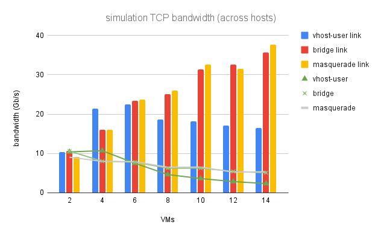

In the cross-node communication scenario, the bandwidth of vhost-user link is different from that of the same host communication scenario when there are only two VMs communicating with each other. It's because the PMD thread needs to copy data between the vhost-user VM and the physical NIC driver buffer, and the shared memory of the VM does not contribute much. As the number of VMs increases, the bandwidth of vhost-user link firstly increases and then decreases and becomes stable, while the bandwidth of bridge/masquerade link gradually increases and exceeds that of vhost-user link. It's because as the number of VMs increases, the processing capability of a single DPDK PMD thread is limited, but the kernel openvswitch can use more computing resources. You can increase the bandwidth of vhost-user link by appropriately increasing the number of CPUs running PMD threads on each NUMA node.

## Statistics

Below is the test result data.

### Vhost-user

**qperf TCP statistics on same host**

| packet size | TCP bandwidth           | TCP PPS  | TCP latency |
|-------------|-------------------------|----------|-------------|
| 1B          | 2.44 MB/s（19.52 Mb/s） | 2.44 M/s | 11.7 us     |
| 2B          | 4.99 MB/s（39.92 Mb/s） | 2.49 M/s | 11.6 us     |
| 4B          | 9.7 MB/s（77.6 Mb/s）   | 2.44 M/s | 11.5 us     |
| 8B          | 18.4 MB/s（147.2 Mb/s） | 2.3 M/s  | 11.5 us     |
| 16B         | 36.1 MB/s（288.8 Mb/s） | 2.26 M/s | 11.5 us     |
| 32B         | 60.5 MB/s（484 Mb/s）   | 1.89 M/s | 11.6 us     |
| 64B         | 123 MB/s（984 Mb/s）    | 1.93 M/s | 11.6 us     |
| 128B        | 134 MB/s（1072 Mb/s）   | 1.05 M/s | 11.6 us     |
| 256B        | 181 MB/s（1.41 Gb/s）   | 706 K/s  | 11.7 us     |
| 512B        | 223 MB/s（1.74 Gb/s）   | 436 K/s  | 11.8 us     |
| 1KB         | 274 MB/s  (2.14 Gb/s)   | 268 K/s  | 12 us       |
| 2KB         | 395 MB/s  (3.09 Gb/s)   | 193 K/s  | 15.7 us     |
| 4KB         | 750 MB/s（5.86 Gb/s）   | 183 K/s  | 16.7 us     |
| 8KB         | 1.41 GB/s（11.28 Gb/s） | 172 K/s  | 18.3 us     |
| 16KB        | 2.25 GB/s（18 Gb/s）    | 137 K/s  | 25 us       |
| 32KB        | 2.91 GB/s（23.28 Gb/s） | 88.8 K/s | 34 us       |
| 64KB        | 2.92 GB/s（23.36 Gb/s） | 44.5 K/s | 58.2 us     |
| 128KB       | 3.17 GB/s（25.36 Gb/s） | 24.2 K/s | 86.6 us     |
| 256KB       | 3.02 GB/s（24.16 Gb/s） | 11.5 K/s | 145 us      |
| 512KB       | 2.71 GB/s  (21.68 Gb/s) | 5.17 K/s | 257 us      |
| 1MB         | 2.36 GB/s  (18.88 Gb/s) | 2.25 K/s | 443 us      |
| 2MB         | 2.25 GB/s（18 Gb/s）    | 1.07 K/s | 859 us      |
| 4MB         | 2.13 GB/s（17.04 Gb/s） | 509 /s   | 2.39 ms     |
| 8MB         | 2 GB/s（16 Gb/s）       | 238 /s   | 5.08 ms     |
| 16MB        | 1.83GB/s（14.64 Gb/s）  | 109/s    | 10 ms       |
| 32MB        | 1.78 GB/s（14.24 Gb/s） | 53 /s    | 18.7 ms     |
| 64MB        | 1.78 GB/s（14.24 Gb/s） | 26.5 /s  | 40 ms       |
| 128MB       | 1.74 GB/s（13.92 Gb/s） | 13 /s    | 80 ms       |

**qperf UDP statistics on same host**

| packet size | UDP receive bandwidth   | UDP PPS | UDP latency |
|-------------|-------------------------|---------|-------------|
| 1B          | 254 KB/s  (1.98 Mb/s)   | 254 K/s | 10 us       |
| 2B          | 509 KB/s  (3.98 Mb/s)   | 254 K/s | 9.9 us      |
| 4B          | 1.02 MB/s  (8.16 Mb/s)  | 254 K/s | 10 us       |
| 8B          | 1.96 MB/s  (15.68 Mb/s) | 244 K/s | 9.9 us      |
| 16B         | 3.75 MB/s  (30 Mb/s)    | 234 K/s | 9.9 us      |
| 32B         | 7.84 MB/s  (62.72 Mb/s) | 237 K/s | 9.9 us      |
| 64B         | 14.7 MB/s  (117.6 Mb/s) | 245 K/s | 9.9 us      |
| 128B        | 38.3 MB/s  (306.4 Mb/s) | 299 K/s | 10 us       |
| 256B        | 73 MB/s  (584 Mb/s)     | 285 K/s | 10 us       |
| 512B        | 147 MB/s  (1176 Mb/s)   | 287 K/s | 10.1 us     |
| 1KB         | 316 MB/s  (2528 MB/s)   | 309 K/s | 10.7 us     |

**simulation statistics on same host**

| VMs | VM TCP bandwidth | Link TCP bandwidth | latency |
|-----|------------------|--------------------|---------|
| 2   | 28 Gb/s          | 28 Gb/s            | 0.1 ms  |
| 4   | 10.5 Gb/s        | 21 Gb/s            | 0.1 ms  |
| 6   | 6.9 Gb/s         | 20.7 Gb/s          | 0.1 ms  |
| 8   | 5.42 Gb/         | 21.68 Gb/s         | 0.1 ms  |
| 10  | 4.01 Gb/s        | 20.05 Gb/s         | 0.1 ms  |
| 12  | 3.46 Gb/s        | 20.76 Gb/s         | 0.1 ms  |
| 14  | 2.9 Gb/s         | 20.3 Gb/s          | 0.1 ms  |

**qperf TCP statistics on across hosts**

| packet size | TCP bandwidth           | TCP PPS  | TCP latency |
|-------------|-------------------------|----------|-------------|
| 1B          | 2.53 MB/s（20.24 Mb/s） | 2.53 M/s | 15.4 us     |
| 2B          | 4.97 MB/s（39.76 Mb/s） | 2.49 M/s | 15.9 us     |
| 4B          | 9.31 MB/s（74.48 Mb/s） | 2.33 M/s | 17.2 us     |
| 8B          | 18 MB/s（144 Mb/s）     | 2.25 M/s | 17.2 us     |
| 16B         | 35 MB/s（280 Mb/s）     | 2.19 M/s | 17.3 us     |
| 32B         | 67.6 MB/s（540.8 Mb/s） | 2.11 M/s | 15.6 us     |
| 64B         | 126 MB/s（1008 Mb/s）   | 1.97 M/s | 15.6 us     |
| 128B        | 218 MB/s（1.7 Gb/s）    | 1.7 M/s  | 16 us       |
| 256B        | 292 MB/s（2.28 Gb/s）   | 1.14 M/s | 16 us       |
| 512B        | 590 MB/s（4.61 Gb/s）   | 1.15 M/s | 17.7 us     |
| 1KB         | 842 MB/s  (6.58 Gb/s)   | 832 K/s  | 17.3 us     |
| 2KB         | 945 MB/s  (7.38 Gb/s)   | 461 K/s  | 22.3 us     |
| 4KB         | 1.16 GB/s  (9.28 Gb/s)  | 284 K/s  | 23.5 us     |
| 8KB         | 1.26 GB/s  (10.08 Gb/s) | 154 K/s  | 28.7 us     |
| 16KB        | 1.33 GB/s  (10.64 Gb/s) | 81.3 K/s | 37.9 us     |
| 32KB        | 1.3 GB/s  (10.4 Gb/s)   | 39.7 K/s | 49.8 us     |
| 64KB        | 1.2 GB/s  (9.6 Gb/s)    | 18.3 K/s | 83.5 us     |
| 128KB       | 1.25 GB/s  (10 Gb/s)    | 9.5 K/s  | 136 us      |
| 256KB       | 1.29 GB/s  (10.32 Gb/s) | 4.92 K/s | 244 us      |
| 512KB       | 1.18 GB/s  (9.44 Gb/s)  | 2.25 K/s | 489 us      |
| 1MB         | 1.21 GB/s  (9.68 Gb/s)  | 1.15 K/s | 898 us      |
| 2MB         | 1.14 GB/s（9.12 Gb/s）  | 542 /s   | 1.96 ms     |
| 4MB         | 1.17 GB/s（9.36 Gb/s）  | 280 /s   | 4.38 ms     |
| 8MB         | 1.09 GB/s（8.72 Gb/s）  | 130 /s   | 10.1 ms     |
| 16MB        | 990 MB/s（7.73 Gb/s）   | 59 /s    | 18.5 ms     |
| 32MB        | 990 MB/s（7.73 Gb/s）   | 29.5 /s  | 33.9 ms     |
| 64MB        | 940 MB/s（7.34 Gb/s）   | 14 /s    | 71.4 ms     |
| 128MB       | 940 MB/s（7.34 Gb/s）   | 7 /s     | 154 ms      |

**qperf UDP statistics on across hosts**

| packet size | UDP receive bandwidth   | UDP PPS | UDP latency |
|-------------|-------------------------|---------|-------------|
| 1B          | 262 KB/s  (2.05 Mb/s)   | 262 K/s | 14.1 us     |
| 2B          | 534 KB/s  (4.17 Mb/s)   | 267 K/s | 14.2 us     |
| 4B          | 1.04 MB/s  (8.32 Mb/s)  | 262 K/s | 14.7 us     |
| 8B          | 2.1 MB/s  (16.8 Mb/s)   | 262 K/s | 14.8 us     |
| 16B         | 3.83 MB/s  (30.64 Mb/s) | 239 K/s | 15.6 us     |
| 32B         | 8.05 MB/s  (64.4 Mb/s)  | 253 K/s | 13.9 us     |
| 64B         | 14.8 MB/s  (118.4 Mb/s) | 232 K/s | 14.5 us     |
| 128B        | 42.2 MB/s  (337.6 Mb/s) | 330 K/s | 15 us       |
| 256B        | 81.9 MB/s  (655.2 Mb/s) | 320 K/s | 15.1 us     |
| 512B        | 132 MB/s  (1056 Mb/s)   | 258 K/s | 16.1 us     |
| 1KB         | 261 MB/s  (2088 Mb/s)   | 255 K/s | 16.2 us     |

**simulation statistics on across hosts**

| VMs | VM TCP bandwidth | Link TCP bandwidth | latency |
|-----|------------------|--------------------|---------|
| 2   | 10.4 Gb/s        | 10.4 Gb/s          | 0.1 ms  |
| 4   | 10.7 Gb/s        | 21.4 Gb/s          | 0.1 ms  |
| 6   | 7.5 Gb/s         | 22.5 Gb/           | 0.1 ms  |
| 8   | 4.64 Gb/s        | 18.56 Gb/s         | 0.1 ms  |
| 10  | 3.63 Gb/s        | 18.15 Gb/s         | 0.1 ms  |
| 12  | 2.85 Gb/s        | 17.1 Gb/s          | 0.1 ms  |
| 14  | 2.35 Gb/s        | 16.45 Gb/s         | 0.1 ms  |

### Bridge

**qperf statistics on same host**

| packet size | TCP bandwidth           | TCP PPS  | TCP latency |
|-------------|-------------------------|----------|-------------|
| 1B          | 2.12 MB/s（16.96 Mb/s） | 2.12 M/s | 42.6 us     |
| 2B          | 4.18 MB/s（33.44 Mb/s） | 2.09 M/s | 42.5 us     |
| 4B          | 6.76 MB/s（54.08 Mb/s） | 1.69 M/s | 42.5 us     |
| 8B          | 10.5 MB/s（84 Mb/s）    | 1.31 M/s | 42.5 us     |
| 16B         | 15.2 MB/s（121.6 Mb/s） | 948 K/s  | 42.4 us     |
| 32B         | 20 MB/s（160 Mb/s）     | 626 K/s  | 42.4 us     |
| 64B         | 44.7 MB/s（357.6 Mb/s） | 698 K/s  | 42.9 us     |
| 128B        | 189 MB/s（1.48 Gb/s）   | 1.48 M/s | 42.9 us     |
| 256B        | 169 MB/s（1.31 Gb/s）   | 660 K/s  | 43 us       |
| 512B        | 353 MB/s（2.76 Gb/s）   | 689 K/s  | 43.1 us     |
| 1KB         | 731 MB/s（5.71 Gb/s）   | 714 K/s  | 43.4 us     |
| 2KB         | 1.11 GB/s  (8.88 Gb/s)  | 544 K/s  | 65.6 us     |
| 4KB         | 1.23 GB/s  (9.84 Gb/s)  | 301 K/s  | 66.7 us     |
| 8KB         | 1.48 GB/s  (11.84 Gb/s) | 181 K/s  | 69.9 us     |
| 16KB        | 1.53 GB/s  (12.24 Gb/s) | 93.3 K/s | 71.5 us     |
| 32KB        | 1.56 GB/s  (12.48 Gb/s) | 47.6 K/s | 82.7 us     |
| 64KB        | 1.59 GB/s  (12.72 Gb/s) | 24.3 K/s | 123 us      |
| 128KB       | 1.63 GB/s  (13.04 Gb/s) | 12.5 K/s | 174 us      |
| 256KB       | 1.63 GB/s  (13.04 Gb/s) | 6.23 K/s | 287 us      |
| 512KB       | 1.63 GB/s  (13.04 Gb/s) | 3.1 K/s  | 495 us      |
| 1MB         | 1.61 GB/s  (12.88 Gb/s) | 1.53 K/s | 929 us      |
| 2MB         | 1.47 GB/s（11.76 Gb/s） | 702 /s   | 1.93 ms     |
| 4MB         | 1.19 GB/s（9.52 Gb/s）  | 285 /s   | 4.17 ms     |
| 8MB         | 1.14 GB/s（9.12 Gb/s）  | 136 /s   | 8.58 ms     |
| 16MB        | 1.12 GB/s（8.96 Gb/s）  | 66.5 /s  | 14.1 ms     |
| 32MB        | 1.11 GB/s（8.88 Gb/s）  | 33 /s    | 27.4 ms     |
| 64MB        | 1.07 GB/s（8.56 Gb/s）  | 16 /s    | 55.6 ms     |
| 128MB       | 1.01 GB/s（8.08 Gb/s）  | 7.5 /s   | 125 ms      |

**qperf UDP statistics on same host**

| packet size | UDP receive bandwidth   | UDP PPS | UDP latency |
|-------------|-------------------------|---------|-------------|
| 1B          | 174 KB/s  (1.36 Mb/s)   | 174 K/s | 39.8 us     |
| 2B          | 349 KB/s  (2.73 Mb/s)   | 175 K/s | 39.7 us     |
| 4B          | 700 KB/s  (5.47 Mb/s)   | 175 K/s | 39.8 us     |
| 8B          | 1.4 MB/s  (11.2 Mb/s)   | 175 K/s | 40 us       |
| 16B         | 2.79 MB/s  (22.32 Mb/s) | 175 K/s | 39.6 us     |
| 32B         | 5.57 MB/s  (44.56 Mb/s) | 174 K/s | 40 us       |
| 64B         | 11.2 MB/s  (89.6 Mb/s)  | 174 K/s | 39.8 us     |
| 128B        | 21.5 MB/s  (172 Mb/s)   | 168 K/s | 40.7 us     |
| 256B        | 43.1 MB/s  (344.8 Mb/s) | 168 K/s | 40.7 us     |
| 512B        | 85.8 MB/s  (686.4 Mb/s) | 168 K/s | 40.7 us     |
| 1KB         | 168 MB/s  (1344 Mb/s)   | 163 K/s | 40.9 us     |

**simulation statistics on same host**

| VMs | VM TCP bandwidth | Link TCP bandwidth | latency |
|-----|------------------|--------------------|---------|
| 2   | 12.2 Gb/s        | 12.2 Gb/s          | 0.1 ms  |
| 4   | 8.96 Gb/s        | 17.92 Gb/s         | 0.1 ms  |
| 6   | 7.89 Gb/s        | 23.67 Gb/s         | 0.13 ms |
| 8   | 7.12 Gb/s        | 28.49 Gb/s         | 0.15 ms |
| 10  | 6.58 Gb/s        | 32.88 Gb/s         | 0.18 ms |
| 12  | 6.02 Gb/s        | 36.09 Gb/s         | 0.17 ms |
| 14  | 5.51 Gb/s        | 38.59 Gb/s         | 0.19 ms |

**qperf TCP statistics on across hosts**

| packet size | TCP bandwidth           | TCP PPS   | TCP latency |
|-------------|-------------------------|-----------|-------------|
| 1B          | 2.17 MB/s（17.38 Mb/s） | 2.17 M/s  | 48.1 us     |
| 2B          | 3.88 MB/s（31.04 Mb/s） | 1.94  M/s | 47.9 us     |
| 4B          | 6.66 MB/s（53.28 Mb/s） | 1.66 M/s  | 47.9 us     |
| 8B          | 10.7 MB/s（85.6 Mb/s）  | 1.34 M/s  | 48 us       |
| 16B         | 17.5 MB/s（140 Mb/s）   | 1.1 M/s   | 47.8 us     |
| 32B         | 19.4 MB/s（155.2 Mb/s） | 606 K/s   | 47.8 us     |
| 64B         | 48.2 MB/s（385.6 Mb/s） | 753 K/s   | 48.5 us     |
| 128B        | 57.2 MB/s（457.6 Mb/s） | 447 K/s   | 48.7 us     |
| 256B        | 66.1 MB/s（528.8 Mb/s） | 258 K/s   | 49 us       |
| 512B        | 163MB/s（1.27 Gb/s）    | 319 K/s   | 48.7 us     |
| 1KB         | 470 MB/s（3.67 Gb/s）   | 459 K/s   | 48.7 us     |
| 2KB         | 1.21 GB/s（9.68 Gb/s）  | 592 K/s   | 67.9 us     |
| 4KB         | 1.29 GB/s  (10.32 Gb/s) | 315 K/s   | 71.9 us     |
| 8KB         | 1.35 GB/s  (10.8 Gb/s)  | 165 K/s   | 75.2 us     |
| 16KB        | 1.32 GB/s  (10.56 Gb/s) | 80.7 K/s  | 97.2 us     |
| 32KB        | 1.34 GB/s  (10.72 Gb/s) | 40.9 K/s  | 133 us      |
| 64KB        | 1.38 GB/s  (11.04 Gb/s) | 21.2 K/s  | 172 us      |
| 128KB       | 1.34 GB/s  (10.72 Gb/s) | 10.2 K/s  | 238 us      |
| 256KB       | 1.33GB/s  (10.64 Gb/s)  | 5.08 K/s  | 378 us      |
| 512KB       | 1.31 GB/s（10.48 Gb/s） | 2.49 K/s  | 583 us      |
| 1MB         | 1.3 GB/s  (10.4 Gb/s)   | 1.24 K/s  | 1.08 ms     |
| 2MB         | 1.27 GB/s（10.16 Gb/s） | 604 /s    | 2.11 ms     |
| 4MB         | 1.24 GB/s（9.92 Gb/s）  | 294 /s    | 4.93 ms     |
| 8MB         | 1.2 GB/s（9.6 Gb/s）    | 143 /s    | 8.66 ms     |
| 16MB        | 1.17 GB/s（9.36 Gb/s）  | 69.5 /s   | 16.7 ms     |
| 32MB        | 1.12 GB/s（8.96 Gb/s）  | 33.5 /s   | 32.3 ms     |
| 64MB        | 1.07 GB/s（8.56 Gb/s）  | 16 /s     | 64.5 ms     |
| 128MB       | 1.07 GB/s（8.56 Gb/s）  | 8 /s      | 167 ms      |

**qperf UDP statistics on across hosts**

| packet size | UDP receive bandwidth   | UDP PPS | UDP latency |
|-------------|-------------------------|---------|-------------|
| 1B          | 168 KB/s  (1.31 Mb/s)   | 168 K/s | 44.5 us     |
| 2B          | 345 KB/s（2.7 Mb/s）    | 173 K/s | 45.3 us     |
| 4B          | 691 KB/s  (5.40 Mb/s)   | 173 K/s | 45.3 us     |
| 8B          | 1.38 MB/s  (11.04 Mb/s) | 173 K/s | 45.4 us     |
| 16B         | 2.74 MB/s（21.92 Mb/s） | 171 K/s | 45.2 us     |
| 32B         | 5.48 MB/s  (43.84 Mb/s) | 171 K/s | 45.4 us     |
| 64B         | 11 MB/s  (88 MB/s)      | 172 K/s | 45.6 us     |
| 128B        | 21.2 MB/s  (169.6 Mb/s) | 166 K/s | 46.3 us     |
| 256B        | 42.4 MB/s  (339.2 Mb/s) | 166 K/s | 46.8 us     |
| 512B        | 84 MB/s  (672 Mb/s)     | 164 K/s | 46.3 us     |
| 1KB         | 167 MB/s  (1336 Mb/s)   | 163 K/s | 46.8 us     |

**simulation statictis on across hosts**

| VMs | VM TCP bandwidth | Link TCP bandwidth | latency |
|-----|------------------|--------------------|---------|
| 2   | 10.6 Gb/s        | 10.6 Gb/s          | 0.2 ms  |
| 4   | 8.03 Gb/s        | 16.05 Gb/s         | 0.2 ms  |
| 6   | 7.8 Gb/s         | 23.4 Gb/s          | 0.2 ms  |
| 8   | 6.26 Gb/s        | 25.02 Gb/s         | 0.2 ms  |
| 10  | 6.26 Gb/s        | 31.3 Gb/s          | 0.2 ms  |
| 12  | 5.44 Gb/s        | 32.62 Gb/s         | 0.2 ms  |
| 14  | 5.09 Gb/s        | 35.64 Gb/s         | 0.2 ms  |

### Masquerade

**qperf TCP statistics on same host**

| packet size | TCP bandwidth           | TCP PPS  | TCP latency |
|-------------|-------------------------|----------|-------------|
| 1B          | 1.98 MB/s（15.84 Mb/s） | 1.98 M/s | 45.1 us     |
| 2B          | 4.02 MB/s（32.16 Mb/s） | 2.01 M/s | 45 us       |
| 4B          | 6.5 MB/s（52 Mb/s）     | 1.62 M/s | 45 us       |
| 8B          | 10 MB/s（80 Mb/s）      | 1.25 M/s | 45 us       |
| 16B         | 14.8 MB/s（118.4 Mb/s） | 924 K/s  | 45.1 us     |
| 32B         | 19.2 MB/s（153.6 Mb/s） | 599 K/s  | 45 us       |
| 64B         | 86.1 MB/s（688.8 Mb/s） | 1.35 M/s | 45.4 us     |
| 128B        | 183 MB/s（1.43 Gb/s）   | 1.43 M/s | 45.6 us     |
| 256B        | 179 MB/s（1.40 Gb/s）   | 699 K/s  | 45.7 us     |
| 512B        | 374 MB/s（2.92 Gb/s）   | 731 K/s  | 45.9 us     |
| 1KB         | 602 MB/s（4.7 Gb/s）    | 608 K/s  | 45.7 us     |
| 2KB         | 1.09 MB/s（8.72 Gb/s）  | 534 K/s  | 69.8 us     |
| 4KB         | 1.28 GB/s（10.24 Gb/s） | 313 K/s  | 70.9 us     |
| 8KB         | 1.45 GB/s（11.6 Gb/s）  | 177 K/s  | 74 us       |
| 16KB        | 1.49 GB/s（11.92 Gb/s） | 90.8 K/s | 78.2 us     |
| 32KB        |  1.5 GB/s（12 Gb/s）    | 45.7 K/s | 86.3 us     |
| 64KB        | 1.53 GB/s（12.24 Gb/s） | 23.3 K/s | 130 us      |
| 128KB       | 1.59 GB/s（12.72 Gb/s） | 12.1 K/s | 183 us      |
| 256KB       | 1.59 GB/s（12.72 Gb/s） | 6.08 K/s | 345 us      |
| 512KB       | 1.58 GB/s（12.64 Gb/s） | 3.01 K/s | 519 us      |
| 1MB         | 1.56 GB/s（12.48 Gb/s） | 1.49 K/s | 911 us      |
| 2MB         | 1.51 GB/s（12.08 Gb/s） | 720 /s   | 1.7 ms      |
| 4MB         | 1.17 GB/s（9.36 Gb/s）  | 280 /s   | 3.46 ms     |
| 8MB         | 1.15 GB/s（9.2 Gb/s）   | 136 /s   | 7.6 ms      |
| 16MB        | 1.17 GB/s（9.36 Gb/s）  | 66.5 /s  | 14.4 ms     |
| 32MB        | 1.09 GB/s（8.72 Gb/s）  | 32.5 /s  | 29 ms       |
| 64MB        | 1.07 GB/s（8.56 Gb/s）  | 16 /s    | 58.8 ms     |
| 128MB       | 1.01 GB/s（8.08 Gb/s）  | 7.5 /s   | 125 ms      |

**qperf UDP statistics on same host**

| packet size | UDP receive bandwidth   | UDP PPS | UDP latency |
|-------------|-------------------------|---------|-------------|
| 1B          | 151 KB/s  (1.18 Mb/s)   | 151 K/s | 42.3  us    |
| 2B          | 306 KB/s  (2.39 Mb/s)   | 153 K/s | 42.1 us     |
| 4B          | 618 KB/s（4.83 Mb/s）   | 154 K/s | 42 us       |
| 8B          | 1.24 MB/s（9.92 Mb/s）  | 155 K/s | 41.7 us     |
| 16B         | 2.43 MB/s  (19.44 Mb/s) | 152 K/s | 42.1 us     |
| 32B         | 4.84 MB/s  (38.72 Mb/s) | 151 K/s | 41.9 us     |
| 64B         | 9.5 MB/s  (76 Mb/s)     | 149 K/s | 42 us       |
| 128B        | 18.1 MB/s  (144.8 Mb/s) | 141 K/s | 42.8 us     |
| 256B        | 35.5 MB/s  (284 Mb/s)   | 139 K/s | 42.8 us     |
| 512B        | 74 MB/s  (592 Mb/s)     | 145 K/s | 43 us       |
| 1KB         | 145 MB/s  (1160 Mb/s)   | 141 K/s | 43.1 us     |

**simulation statistics on same host**

| VMs | VM TCP bandwidth | Link TCP bandwidth | latency |
|-----|------------------|--------------------|---------|
| 2   | 9.31 Gb/s        | 9.31 Gb/s          | 0.1 ms  |
| 4   | 9.09 Gb/s        | 18.17 Gb/s         | 0.1 ms  |
| 6   | 7.91 Gb/s        | 23.74 Gb/s         | 0.1 ms  |
| 8   | 7.24 Gb/s        | 28.97 Gb/s         | 0.1 ms  |
| 10  | 6.6 Gb/s         | 33.01 Gb/s         | 0.1 ms  |
| 12  | 6.08 Gb/s        | 36.48 Gb/s         | 0.12 ms |
| 14  | 5.56 Gb/s        | 38.92 Gb/s         | 0.15 ms |

**qperf TCP statistics on across hosts**

| packet size | TCP bandwidth            | TCP PPS   | TCP latency |
|-------------|--------------------------|-----------|-------------|
| 1B          | 2.24 MB/s（17.92 Mb/s）  | 2.24 M/s  | 55.3 us     |
| 2B          | 3.93 MB/s（31.44 Mb/s）  | 1.96 M/s  | 52.1 us     |
| 4B          | 6.53 MB/s（52.24 Mb/s）  | 1.63 M/s  | 55.6 us     |
| 8B          | 10.6 MB/s（84.8 Mb/s）   | 1.33 M/s  | 51.5 us     |
| 16B         | 15.9 MB/s（127.2 Mb/s）  | 996 K/s   | 51.8 us     |
| 32B         | 18.6 MB/s（148.8 Mb/s）  | 581 K/s   | 51.6 us     |
| 64B         | 28.5 MB/s（228 Mb/s）    | 445 K/s   | 52.6 us     |
| 128B        | 56 MB/s（448 Mb/s）      | 438 K/s   | 52.1 us     |
| 256B        | 98.2 MB/s（785.6 Mb/s）  | 384 K/s   | 52.7 us     |
| 512B        | 211 MB/s（1.65 Gb/s）    | 413 K/s   | 53 us       |
| 1KB         | 581 MB/s（4.54 Gb/s）    | 568 K/s   | 52.8 us     |
| 2KB         | 1.08 GB/s（8.64 Gb/s     | 529 K/s   | 78.9 us     |
| 4KB         | 1.38 GB/s（11.04 Gb/s）  | 337 K/s   | 77.9 us     |
| 8KB         | 1.42 GB/s（11.36 Gb/s）  | 174 K/s   | 80.8 us     |
| 16KB        | 1.33 GB/s（10.64 Gb/s）  | 81.4 K/s  | 101 us      |
| 32KB        |  1.33 GB/s（10.64 Gb/s） | 40.5 K/s  | 126 us      |
| 64KB        | 1.33 GB/s（10.64 Gb/s）  | 20.3 K/s  | 169 us      |
| 128KB       | 1.33 GB/s（10.64 Gb/s）  | 10.2 K/s  | 254 us      |
| 256KB       | 1.31 GB/s（10.28 Gb/s）  | 4.99 K/s  | 403 us      |
| 512KB       | 1.33 GB/（10.64 Gb/s）   | 2.54 K/s  | 599 us      |
| 1MB         | 1.3 GB/s（10.4 Gb/s）    | 1.24 K/s  | 1.07 ms     |
| 2MB         | 1.27 GB/s（10.16 Gb/s）  | 606 /s    | 2.13 ms     |
| 4MB         | 1.22 GB/s（9.76 Gb/s）   | 292 /s    | 4.61 ms     |
| 8MB         | 1.17 GB/s（9.36 Gb/s）   | 139 /s    | 8.62 ms     |
| 16MB        | 1.17 GB/s（9.36 Gb/s）   | 69.5 /s   | 17.7 ms     |
| 32MB        | 1.17 GB/s（9.36 Gb/s）   | 35 /s     | 39.2 ms     |
| 64MB        | 1.14 GB/s（9.12 Gb/s）   | 17 /s     | 62.5 ms     |
| 128MB       | 1.07 GB/s（8.56 Gb/s）   | 8 /s      | 133 ms      |

**qperf UDP statistics on across hosts**

| packet size | UDP receive bandwidth   | UDP PPS | UDP latency |
|-------------|-------------------------|---------|-------------|
| 1B          | 167 KB/s  (1.18 Mb/s)   | 167 K/s | 48.9  us    |
| 2B          | 340 KB/s  (2.39 Mb/s)   | 170 K/s | 48.7 us     |
| 4B          | 690 KB/s（4.83 Mb/s）   | 173 K/s | 48.6 us     |
| 8B          | 1.39 MB/s（9.92 Mb/s）  | 173 K/s | 48.4 us     |
| 16B         | 2.14 MB/s  (19.44 Mb/s) | 134 K/s | 48.7 us     |
| 32B         | 5.49 MB/s  (38.72 Mb/s) | 171 K/s | 48.6 us     |
| 64B         | 11 MB/s  (76 Mb/s)      | 172 K/s | 49.5 us     |
| 128B        | 21.6 MB/s  (144.8 Mb/s) | 169 K/s | 49.3 us     |
| 256B        | 42.6 MB/s  (284 Mb/s)   | 166 K/s | 49.6 us     |
| 512B        | 83.6 MB/s  (592 Mb/s)   | 163 K/s | 50.1 us     |
| 1KB         | 164 MB/s  (1160 Mb/s)   | 161 K/s | 52.9 us     |

**simulation statistics on across hosts**

| VMs | VM TCP bandwidth | Link TCP bandwidth | latency |
|-----|------------------|--------------------|---------|
| 2   | 9.04 Gb/s        | 9.04 Gb/s          | 0.15 ms |
| 4   | 7.99 Gb/s        | 15.98 Gb/s         | 0.2 ms  |
| 6   | 7.92 Gb/s        | 23.75 Gb/s         | 0.2 ms  |
| 8   | 6.5 Gb/s         | 25.99 Gb/s         | 0.2 ms  |
| 10  | 6.53 Gb/s        | 32.65 Gb/s         | 0.2 ms  |
| 12  | 5.26 Gb/s        | 31.54 Gb/s         | 0.2 ms  |
| 14  | 5.37 Gb/s        | 37.58 Gb/s         | 0.2 ms  |
