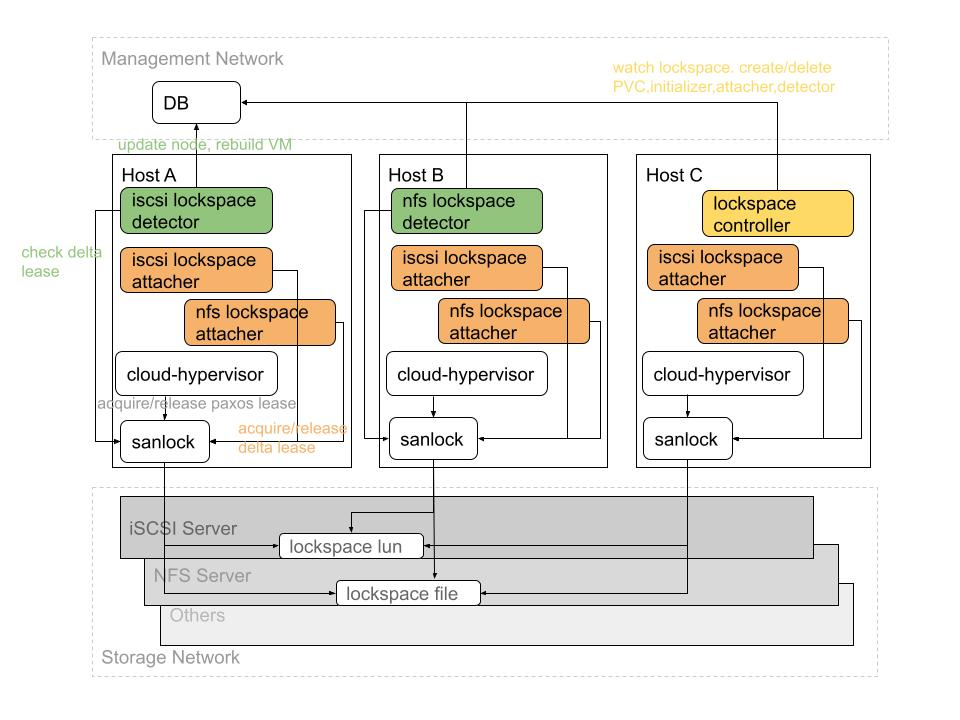

# VM HA

Virtink uses [sanlock](https://pagure.io/sanlock) for VM HA (high availability), and includes lock to avoid VM "split-brain" situation, which can lead to two active copies of a VM after recovery from a failure. Besides "split-brain" situation, the lock is also used to prevent two VM processes from having concurrent write access to the same disk image, as this will result in data corruption if the guest is not using a cluster aware filesystem. 

## Goals

- [x] **VM HA with the ability to avoid VM "split-brain" situation**. The "split-brain" situation means there would be multiple active copies of a VM after recovery from a failure

- [x] **VM HA based on the health state of the storage instead of node**. If a node can not acess storage A but can still access storage B, the HA VMs running on this node that have locks in storage A will be rebuilt on the other nodes, but the HA VMs without locks in storage A will still run on this node

- [x] **Disk lock to prevent multiple VMs from having concurrent access to the same disk image**

- [ ] **Live migration for the VMs with disk locks, or even enable HA**

## Architecture



- `Lockspace` is a no-namespaced CRD object refers to the specific storage, and each storage has its own Lockspace. E.g `nfs-1-lockspace`, `nfs-2-lockspace`, `iscsi-1-lockspace` and etc.

- `Lock` is a CRD object refers to the disk locks in the Lockspace, the VM with Locks can get start only after the corresponding disk locks are obtained, and Lock can be used to prevent multiple VMs from having concurrent access to the same disk image.

- `lockspace-volume` is a PVC object refers to the shared block device or file used for Locks in storage.

- `sanlock` is a per-node daemon, responsible for acquiring/releasing/checking Locks in each Lockspace volume, and there is only one sanlock daemon instance on each node.

- `lockspace-controller` is a cluster-wide controller, responsible for creating/cleaning volume, initializer, attacher and detector for each Lockspace. This controller is deployed with `virt-controller`.

- `lockspace-initializer` is a run once Pod, responsible for initializing node lease space (also named delta lease in sanlock) in the corresponding Lockspace volume.

- `lockspace-attacher` is a per-node daemon, responsible for attaching/detaching node to/from the corresponding Lockspace. And attacher will bind mount the Lockspace volume to host path for sanlock daemon to access.

- `lockspace-detector` is a cluster-wide controller, responsible for heartbeat detection of each node in the corresponding Lockspace, and rebuild the HA VMs when node is "dead" in the Lockspace.

- `lock-controller` is a cluster-wide controller, responsible for initializing/cleaning disk lock (also named paxos lease in sanlock) in the corresponding Lockspace volume. This controller is deployed with `lockspace-detector`.

## Prerequisites

### Configure Sanlock Host ID

The sanlock host ID is an unique identifier for each node in the cluster, it's used for acquiring node lease by attacher and for heartbeat detection by detector. You can configure it by appending annotation `virtink.smartx.com/sanlock-host-id: "n"` to the Node object, and `n` should be unique for each node in the cluster.

### Deploy CSI Plugin

We currently use CSI driver to create PVC for Lockspace volume, you can try [NFS CSI driver](https://github.com/kubernetes-csi/csi-driver-nfs), [Ceph CSI](https://github.com/ceph/ceph-csi) and etc.

> **Note**: Currently, only the NFS CSI driver is tested officially.

After the CSI installation, you should create a StorageClass for the CSI driver.

### Enable Watchdog Device

The watchdog device is used to reset the "dead" host when the VM process is not cleaned up by sanlock daemon within the pre-configured time, it's the guarantee to avoid VM "split-brain".

You can try kernel module `softdog` for test only when hardware watch dog device is missing.

### Deploy Sanlock Daemon

You can deploy the sanlock daemon directly on the host or try project [Containerized Sanlock Daemon](https://github.com/carezkh/containerized-sanlock-daemon) to deploy this daemon in the container. And the watchdog fire timeout should be 60s. 

## Usage Guides

### Create Lockspace

You can create a Lockspace by the following yaml:

```bash
apiVersion: virt.virtink.smartx.com/v1alpha1
kind: Lockspace
metadata:
  name: nfs-192.168.27.87
spec:
  storageClassName: nfs-192.168.27.87
  volumeMode: Filesystem
  maxLocks: 1000
  ioTimeoutSeconds: 10
```

The details of the fields are as follows:

  - `storageClassName` refers to a storage, and a Lockspace volume will be created here to hold node leases and disk locks.
  - `volumeMode` is the mode of the Lockspace volume, use value `Filesystem` (default) for NAS and `Block` for SAN.
  - `maxLocks` is the maximum number of Lock that can be held in this Lockspace, and a Lockspace volume with size `(n+3)Mi` will be created to hold `n` Locks. Currently this field is imutable after created.
  - `ioTimeoutSeconds` can be used to configure the time of failure recovery only for this Lockspace, please refer to [Failure Recovery](#failure-recovery) for more details.

After the Lockspace initializer succeeded, the Lockspace will be updated as `ready` in status. The attacher will try to attach the node to the Lockspace, and the detector will do heartbeat detection in the Lockspace volume for each node.

### Create Lock

You can create a Lock by the following yaml:

```bash
apiVersion: virt.virtink.smartx.com/v1alpha1
kind: Lock
metadata:
  name: ubuntu
  namespace: default
spec:
  lockspaceName: nfs-192.168.27.87
```

The field `lockspaceName` refers to the Lockspace created above.

The Lock controller will initialize disk lock in the corresponding Lockspace volume, and the Lock will be updated as `ready` in status when succeed.

### Create HA VM

You can refer to the [ubuntu-ha.yaml](../samples/ubuntu-ha.yaml) to create a HA VM.

The details of the fields releated to HA are as follows:

  - `enableHA` is a boolean value indicating whether HA is enabled.
  - `locks` is a list of Lock needed to be obtained by the VM before starts. It's recommended to add a Lock from the same storage as the VM os disk DataVolume, the VM will most likely fail to run properly when the node can not access this storage, it makes sense to rebuild this VM on other nodes. You can also add a Lock for data disk if the state of the corresponding storage is important for the function of the VM. For a "dead" VM with Locks but without HA enabled, it will only be set as `Failed` phase by HA components, the run policy will decide to rebuild it or not.
  - `runPolicy` can be only `RerunOnFailure` and `Always` for VM HA.

## Failure Recovery

When a failure happens, the HA VMs can be rebuilt in the pre-configured time for different situations, and the time here refers to the time elapsed after the failure happens.

> **Note**: We assume that the HA components are running properly when failures happen, otherwise these components need to be restored automatically before recovery the HA VMs. E.g the `virt-controller` running on the node with power failure will be restored in 300s before create the new instances of the HA VMs.

### Storage Failures

The storage failures here refer to only part of nodes in the cluster can not access the storage, the HA VMs can not be recovered when all nodes can not access the storage.

When storage failures happen, the HA VMs with Locks in the corresponding storage start to be cleaned at `T1`, and this cleaning process must be completed **before** `T2`, otherwise the host will be reset by watchdog device. At `T3`, the label `virtink.smartx.com/dead-lockspace-<ls-name>` will be appended to the corresponding Node object, then the VMs with Locks in the "dead" Lockspace will not be scheduled to this node. At `T4`, the "dead" HA VMs will be recovered on the other healthy nodes.

The recovery time can be calculated as follows, and `T1` < `T3` < `T2` < `T4` :

  - t1 < `T1` < t2, t2 = 8 * io_timeout_seconds,        t1 = 6 * io_timeout_seconds;
  - t3 < `T2` < t4, t4 = 8 * io_timeout_seconds + 60s,  t3 = 6 * io_timeout_seconds + 60s;
  - t5 < `T3` < t6, t6 = 12 * io_timeout_seconds,       t5 = 6 * io_timeout_seconds;
  - t7 < `T4` < t8, t8 = 11 * io_timeout_seconds + 60s, t7 = 6 * io_timeout_seconds + 60s;

E.g io_timeout_seconds = 10s, 60s < `T1` < 80s, 120s < `T2` < 140s, 60s < `T3` < 120s, 120s < `T4` < 170s. 

> **Note**: When the node can not access storage A but can still access storage B, the HA VMs running on this node that have Locks in storage A will be rebuilt on the other nodes, but the HA VMs without Locks in storage A will still run on this node.

> **Note**: When the node can not access storage but the management network can still work, the HA VMs will be updated as `Failed` phase by `virt-daemon` at `T1`, and the VMs may be rebuilt on the "dead" node before `T3`.

You can refer to the following steps to recover a node from the "dead" Lockspace:

  - Resolve the storage failures. E.g replace the faulty storage NIC or update the misconfigured firewall rules.
  - Wait for sanlock daemon to remove the corresponding Lockspace in REM (recover mode) state, you can use command `sanlock client status` on host (or in container) to check the state of Lockspace.
  - Delete the Lockspace attacher pod on "dead" node, and it will be recreated by `lockspace-attacher` DaemonSet.

### Node Power Failures

When node power failures happen, the HA VMs running on this node will be recovered on the other healthy nodes at `T4`. At `T3`, the label `virtink.smartx.com/dead-lockspace-<ls-name>` will be appended to the "dead" Node object, then the VMs with Locks in any Lockspace will not be scheduled to this node.

The recovery time can be calculated as follows, and `T3` < `T4` :

  - t5 < `T3` < t6, t6 = 12 * io_timeout_seconds,       t5 = 6 * io_timeout_seconds;
  - t7 < `T4` < t8, t8 = 11 * io_timeout_seconds + 60s, t7 = 6 * io_timeout_seconds + 60s;

E.g io_timeout_seconds = 10s, 60s < `T3` < 120s, 120s < `T2` < 170s.

If the node is manually shut down, you may get a different result, it's because the sanlock daemon may release node lease in this situation, and the `free` node lease will be detected by `free state detector` in `lockspace-detector`. At `T5`, the label `virtink.smartx.com/dead-lockspace-<ls-name>` will be appended to the "dead" Node object, then the HA VMs running on this node will be recovered on the other healthy nodes.

The recovery time can be calculated as follows:

  - t9 < `T5` < t10, t10 = 12 * io_timeout_seconds + 60s, t9 = 8 * io_timeout_seconds + 60s;

E.g io_timeout_seconds = 10s, 140s < `T5` < 180s.

## Known Issues

- The VMs with Locks are not migratable.

- When a node can not access storage but the management network can still work, the HA VMs will be updated as `Failed` phase by `virt-daemon`, and the VMs may be schduled to the "dead" node again before the "dead" Lockspace label is appended to the Node object.

- If you delete a Lockspace that is not ready, or acquiring the node lease is in process (you can see the Lockspace is still in `ADD` state by using command `sanlock client status`), the mount point `/var/lib/sanlock/<ls-name>` will not be cleaned on host, and you should unmount it manually. Otherwise, if you recreate this Lockspace, the new `lockspace-attahcer` Pod will fail to run because of the uncleaned mount point.
